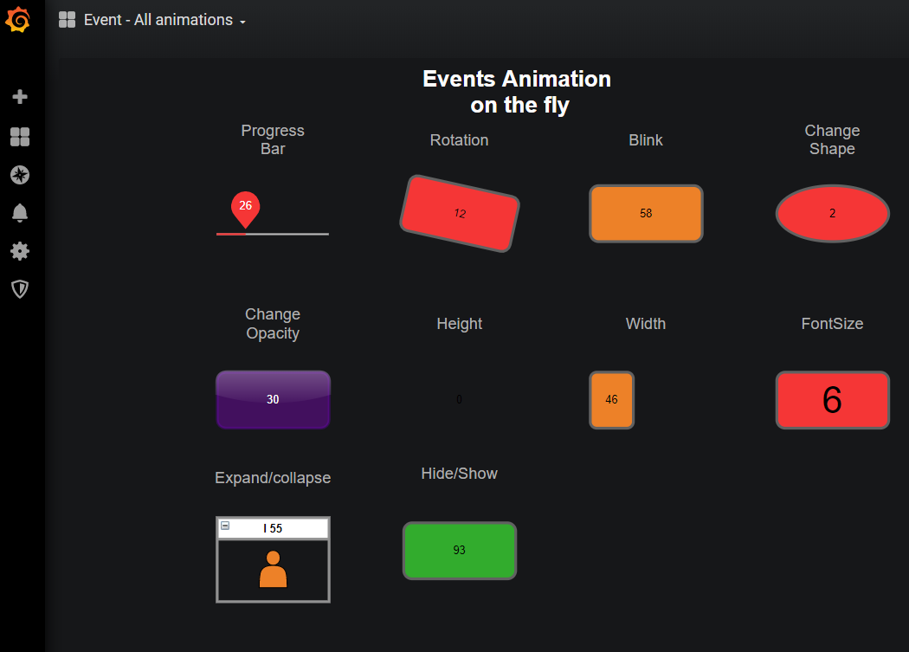
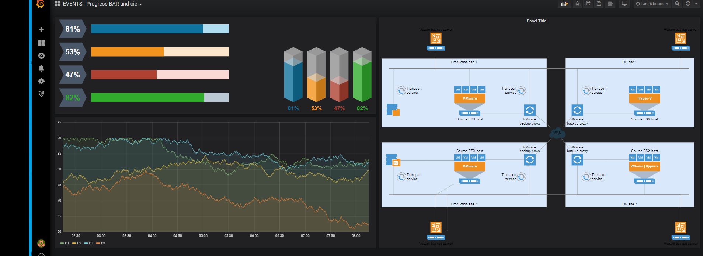
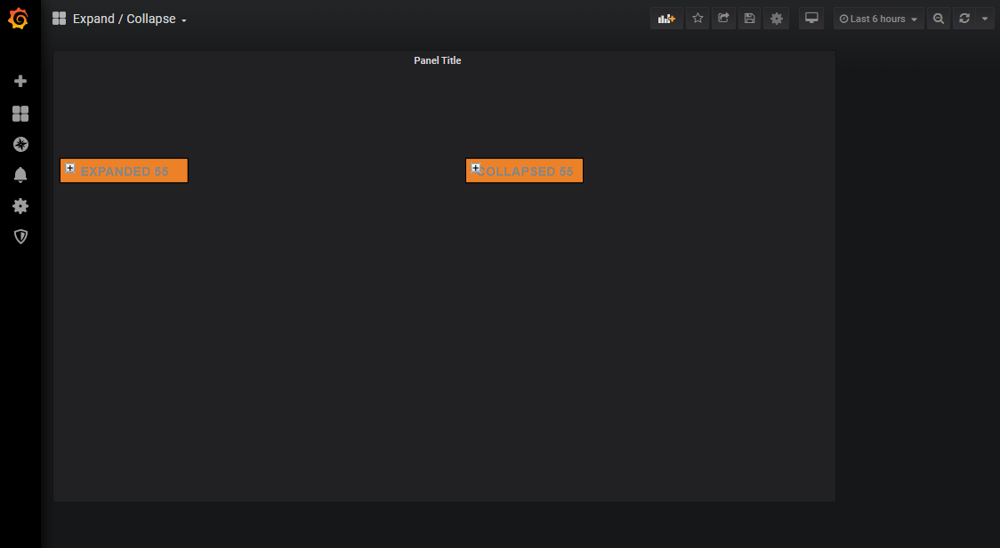

# Events Mapping
Events Mapping is a new feature since version 0.8.0 of Flowcharting
In this section, you can add animation or event according to the level

## Identify by
You can select the method of selection for the field "What" :    
 - by the uniq ID of shapes.
 - by the value of the text (experimental).

## Regular exression
If checked, the field "What" accepts a regular expression (less efficient) like this :
```
/.*My label.*/
```

## Buttons
  -  : Remove line/shapes from current rule
  -  : Hide and ignore line from current rule
  -  : Click on it to select shapes/object in panel and auto fill input with id object.

## What
Enter the id or text of shape, if the field "regular expression" is checked, regular expression is accepted but less efficient for performance.  
You can target/select the shape by clicking on link button.  

## When
Select the level to trigger the animation

## Action
Select the animation

## Value
Select a value for this animation.  
Value field can contain Grafana variables or local variables
[more detail ...](VARIABLES)  

# Available animations
* Shape : Change form (text)  
Enter the name of shape in draw.io.  
To find the name of shape, go to draw.io, select the shape and click on button 'edit style' on the left.  
``` 
shape=cylinder;whiteSpace=wrap;html=1;boundedLbl=1;backgroundOutline=1; 
```
Here, the name is cylinder  

* Shape : Rotate Shape (0-360)  
Enter a number between 0 and 360 (degres)  
    
* Shape : Blink (frequence ms)  
Enter a number (in ms witout 'ms' string)
    - 1000 for 1 second  

* Shape : Hide/Show (0 or 1)  
    - 0 to hide
    - 1 to show

* Shape : Change height (number)  
The number must be a number of pixels
    - Positive value top-down  
    - Negative value down-top  

* Shape : Change width (number)  
The number must be a number of pixels :  
    - Positive value left-right  
    - Negative value right-left  

* Shape : Opacity (0-100)  
Enter a number between 0 and 100  
The number is a percent (don't add a %)

* Shape : Collapse/Expande (0 or 1)  
    - 0 for Collapse a container
    - 1 for expand a container

* Shape : Change position in Bar (0-100)  
Only for GMLD/Slider shapes in draw.io  

* Label : Replace text (text)  
Replace the current text of shape  

* Label : Font Size (numeric)  


* Label : Opacity (numeric)  
Enter a number between 0 and 100  
The number is a percent (don't add a '%')  


* Image : Change URL (text)  
Url of the new image (absolute or relative)

## Somes examples
* All events available in 0.8.0


* Width and height events  
  

* Expand and collapse events
