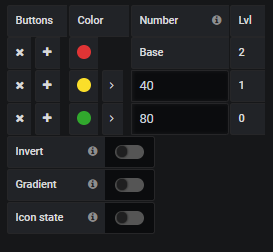
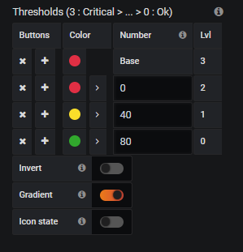

# Thresholds

## Colors and values
Define the color and the value to apply the color

  - Colors : Select a color and opacity
  - value : 
    * If type is a number, the color applied when value is upper or egal to the value.  
    * If type is a string, enter a regular expression to apply color like this :
        - /.*OK*./ :  must be contain OK word
        - /^ERROR.*/ : Bebin by ERROR word 
    * If type is a date, you cannot define a color and a level.

You cannot change the value of the first line, it is the default color when value is below for the number type or when no expression matches for string type.

## Level
For each line, Flowcharting calculate a level number :
  - 0 : OK
  - 1..n : WARNING
  - Last : ERROR/CRITICAL/FATAL
The level determines the status and application conditions for mappings.

## Invert
You can invert the order of the levels and colors by clicking on invert button

## Gradient
flowCharting is able to calculate the intermediate color when the value is between 2 levels with one value.
If there is no associated value, flowCharting takes the raw color of the corresponding level.

### Example

In this example, 3 colors are declared (red, yellow and green ) but only 2 values are associated.
  * If the value is under 40, the applied color is alway RED without gradient because Flowcharting is unable to know the radio between red and yellow ( ? < value > 40)  
  * If the value is between 40 and 80, Flowcharting calculates the ratio with this formule :  
```
(Curr_value - Begin_color_value)/(End_color_value - Begin_color_value)
```
Example, for 60 :
```
(60 - 40)/(80 - 40) = 0.5
```
Flowcharting calculates the color between yellow and red with 0.5 (middle).  

  * If the color is above 80, the color is alway green (80 < value> ?)  

To solve the problem, you need to define a value for red color like this :


### Demo
You can found a big example with floorplan dashboard here :
https://play.grafana.org/d/Unu5JcjWk/flowcharting-index?orgId=1

Or a little example
https://play.grafana.org/d/cX3XoCCWz/flowcharting-gradient-color-mode?orgId=1